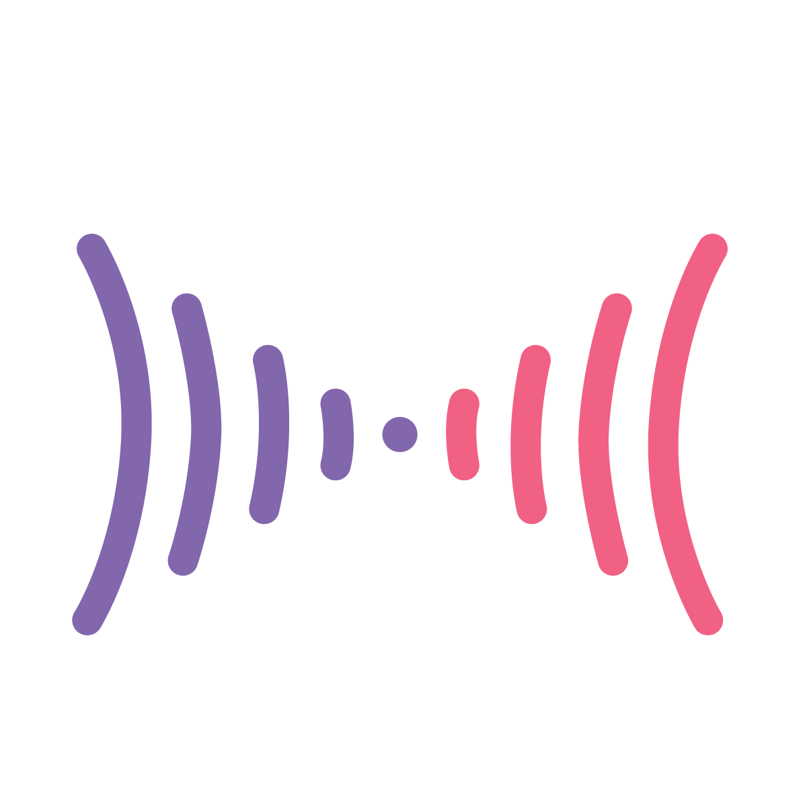

# Mirror-CULLS

Wave hello to the future of IoT and smarthome devices.

## Description

A contactless gesture controlled smart-mirror device and OS with modular applications built.

My final year project for my university course in Computer Science.

## Features

* Integration with a number of APIs including: Spotify, FitBit, GoogleMaps and more!

* A modular and smartphone-style approach to architecture to allow extensibility and maintainability.

* Contact-free gesture controls using a PAJ7620U2 sensor integrated via Python.

* Built with Node.js on the Electron application for performance, low-level access and cross-platform support.

* Originally built with a Raspberry-Pi as the heart of the project, a 3D-printed skeleton and a Hyperpixel display as the face of it all.

## Note

Please note that this was originally developed on a private university version control account that I no longer have access to, hence the lack of commit history within this repo.

## Project Status

**Completed**

(May be revisited in the future to add additional modules/applications).

## License

[MIT](LICENSE)
